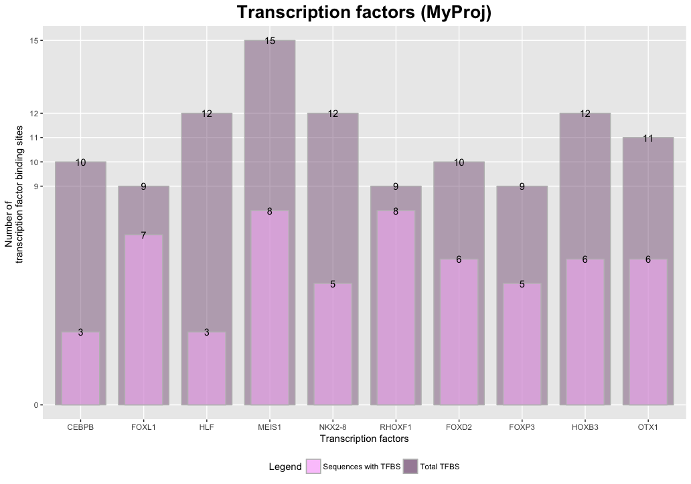
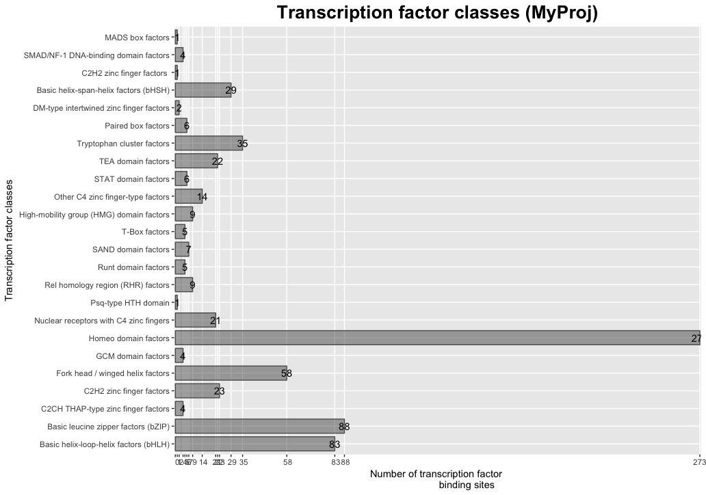
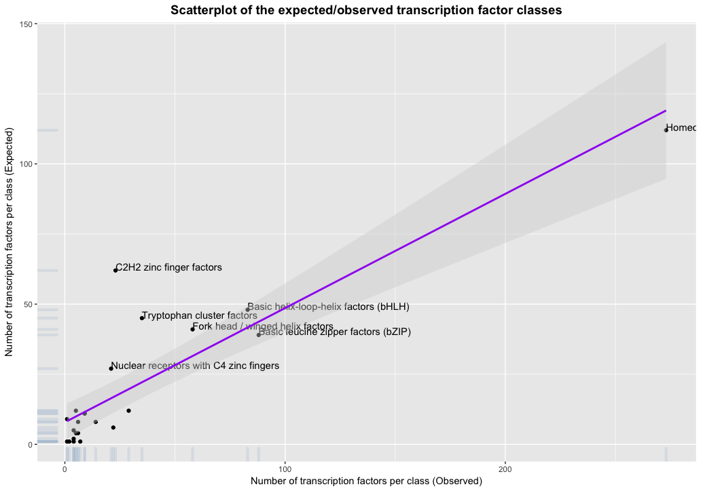
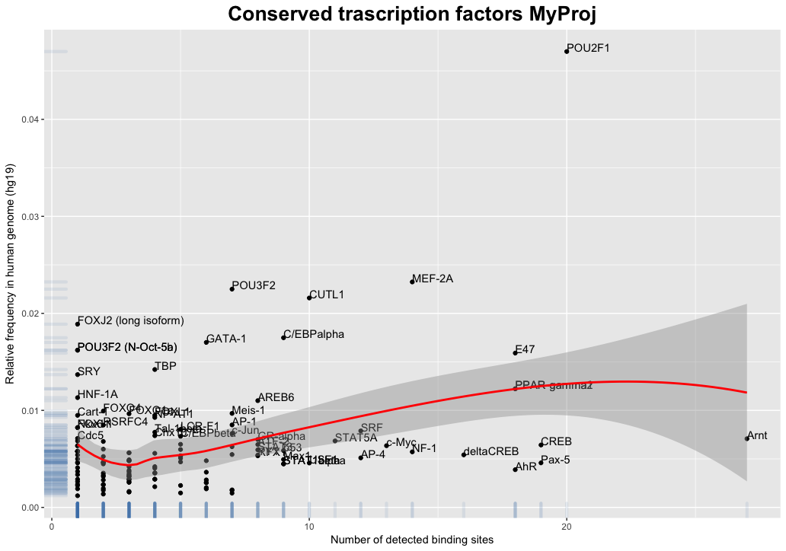
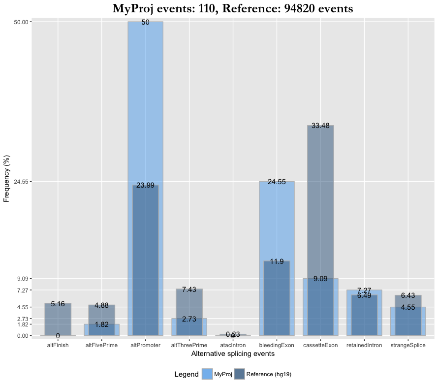

\section{Overview}

MeinteR (MEthylation INTERpretation) is an R package that identifies critical differentially methylated sites (DMS), based on the following hypothesis: Critical methylation-mediated changes are more likely to occur in genomic regions that are enriched in cis-acting regulatory elements than in "genomic deserts”. With MeinteR we first calculate the abundance of co-localized elements, such as transcription factor binding sites, tentative splice sites, and other DNA features, such as G-quadruplexes and palindromes, that potentially lead to distinct DNA conformational features, and then we rank them with respect to their putative methylation impact.
MeinteR supports the most widely-used, single-base resolution assays, including Illumina’s BeadChip HumanMethylation27, HumanMethylation450 and MethylationEPIC arrays, whole genome, reduced representation and targeted bisulfite sequencing. The input data are either tabular files containing DMS coordinates of human genome (hg19 assembly) or array-based and sequencing data that can be directly imported from the Gene Expression Omnibus (GEO) repository.
\subsection{Installation}
To download and install MeinteR and its dependencies, you need to install `devtools` and then run the following R commands:

```
library(devtools)
devtools::install_github("andigoni/meinter", quiet=TRUE)
```
Alternatively, download the binary installation file, unzip it to a folder e.g. `~/MeinteR` and run the following commands:
```
package.folder <- "~/MeinteR"
install_local(package.folder)
```

Upon successful installation of the package, load MeinteR and all its dependencies in the workspace using:
```{r, message=FALSE, eval=FALSE}
library(MeinteR)
```


\section{Getting started}
Before we start, we may carry out a couple of optional preparatory functions, as described below:
\subsection{Setting the working environment}
First, we set a title for our study by using the `nameStudy` function:
```{r, eval=FALSE}
nameStudy(study.name="MyProj")
```
The `study.name` will be used in the generated plot legends. 
Second, we set an analysis folder with read-write access rights e.g.:
```{r, message=FALSE, eval=FALSE}
project.dir <- "~/meinter_dir"
```

\subsection{Formatting and importing datasets}
\subsubsection{Data format}
MeinteR's core functions are applied on bed-formatted files containing the following columns:

__Chr__: Name of the chromosome (e.g. chr3)

__Start__: DMS start coordinate (hg19 assembly)

__End__: DMS end coordinate (hg19 assembly)

__Score__: Difference of methylation levels ranging between -1 and 1

__Strand__: Strand of the DMS. Either "." (=no strand) or "+" or "-"

The `Score` field of the input dataset may correspond to the `Delta-beta` value of each DMS i.e. the difference of the methylation levels in two groups of data, for example normal/disease samples or pre-, post-treatment conditions of a sample set etc.   

In the following, we demostrate the functionalities on a sample dataset assigned to variable `sample`. The `sample` dataset is automatically loaded in the workspace and can be used for demostration.

```{r, message=FALSE, eval=FALSE}
head(sample)
```

The `sample` dataset contains the coordinates and `delta-beta` values for a set of 5,840 CpG sites. The column names of this dataset are not consistent with formatting rules of the input data, so we need to reorder the misplaced columns using the `reorderBed` function:
```{r, eval=FALSE, message=FALSE}
re.sample = reorderBed(sample,1,2,3,5,4) 
head(re.sample)
```
Columns 4 and 5 in the above example will change position. In addition, all columns will be renamed, appropriately. 
\subsubsection{Import local data}
To work on your own data, load the tabular file by setting the column separator (`sep`) and heading (`header`) parameters appropriately. For example,
```{r, eval=FALSE}
input.data <- read.csv(file.path(project.dir, "my_data.csv"), sep=",", header = T)
```
where `my_data.csv` in this example is a comma-delimited file with a header in the first line. Additional columns in the input data will be ignored. For demostration purposes MeinteR provides a well-formatted dataset loaded in the workspace called `test.data` that contains 401 DMS with `|delta-beta|>=0.3'.

\subsubsection{Import data from GEO}

MeinteR supports analyses of GEO data series from microarray and next-generation sequencing platforms. In both cases, MeinteR will automatically fetch data series based on the GSE accession number. A data series usually contains multiple samples analyzed in the same or multiple platforms. MeinteR imports data from a data series that contains two groups of samples analysed in the same platform according to a user-defined annotation file. The annotation file is a comma-delimited file with two columns: Column `sample` lists the GSM accession numbers that are needed for the analyses and are part of the data series and the `status` column lists the class of each sample. For example, to import sample data of the GSE37362 series we must create an annotation file that has the following form:
```
sample,status
GSM916781,WT
GSM916782,WT
GSM916783,WT
GSM916803,Mutant
GSM916804,Mutant
GSM916805,Mutant
```

The `status` column must list only two groups of samples e.g. WT, Mutant. The analysis will be performed on the samples listed in the annotation file. Samples included in the data series, but not in the annotation file, will be ignored. MeinteR will automatically identify the platform will fetch the corresponding sample data. In case of array-based data, the probes will be mapped to the hg19 genomic coordinates and a bed-formatted file will be generated conforming with the formatting rules of the input data. The delta-beta values are automatically calculated by subtracting the mean beta values of the two groups. To import a GEO data series use the function `importGEO` as follows:
```{r, eval=FALSE}
fp <- file.path(project.dir, "GSE37362_annotation.csv")
geo.data <- importGEO(gse.acc="GSE37362", annotation.file= fp)
```
where `gse.acc` is the unique GEO identifier of the data series and `annotation.file` is the local path to the annotation file.

\subsection{Data filtering}
A common preprocessing step is subsetting the initial dataset using filtering of the `score` values. For example: 
```{r, eval=FALSE, message=FALSE}
#Select DMS with delta-beta values equal to 0
subsample.1 <- re.sample[re.sample$score == 0,] 
#Select DMS with delta-beta values greater than or equal to 0.30
subsample.2 <- re.sample[re.sample$score >= 0.30,] 
#Select DMS with absolute delta-beta values greater than or equal to 0.60
subsample.3 <- re.sample[abs(re.sample$score) >= 0.60,] 
```

\section{Core functions}
MeinteR offers a set of core functions that investigate the presence of the following methylation-mediated regulatory features: 

__Transcription factors__: There are two functions that examine the effect of methylation on the binding affinity of a) human transcription factors, and b) conserved human/mouse/rat transcription factors. 

__Splice sites and alternative splicing events__: Splicing regulation is analysed by two functions: a) A function that identifies potential 5' and 3' splice sites in the DMS proximal regions, and b) a function that searches for alternative splicing events overlapping our DMS data.

__Symmetry elements/Palindromes__: With this function DMS are examined with respect to the presence of palindromic regions in a user-defined region centered at the DMS.

__G-quadruplex structures__: With this function the DMS are examined with respect to the presence of G-quadruplex structures.

__DNA shapes__: This function quantifies the effect of DNA methylation on four DNA shape conformations, aiming to identify potential changes on the DNA-protein interactions.


\subsection{Detection of transcription factor binding sites}
\subsubsection{JASPAR transcription factor binding sites}
Function `findTFBS` identifies potential binding sites of human transcription factors in a region of `2*offset` nucleotides centered at the DMS, where offset defines the sequence length on each side and `persim` sets the similarity threshold for considering a trascription factor as candidate for binding. The list of transcription factors, on both strands, is extracted from the JASPAR 2018 database [@khan_jaspar_2018] and processed using `TFBSTools` [@tan_tfbstools_2016]. By default, MeinteR reserves the maximum number of available cores. Still, for large datasets `findTFBS` is time-consuming. In this case, consider shortening the list of target transcription factors using the `td.ID` parameter and/or descreasing the number of DMS to those overlapping with promoters or CpG islands, using the `target` parameter. For example, to identify a list of transcription factor binding sites on `subsample.3` run:

```{r, message=FALSE, eval=FALSE}
#Transcription factors of interest
tf.ID = c("MA0003.1", "MA0019.1", "MA0004.1", "MA0036.3", "MA0037.3")
tfbs <-findTFBS(bed.data=subsample.3,persim=0.8, offset=10, target="PROMOTER", 
                up.tss=2000, down.tss=100, mcores = 2, tf.ID=tf.ID)
```
`findTFBS` returns transcription factors, inluded in the `tf.ID` list, the binding consensus of which resembles at least 80% with the DMS expanded by 10bp on each side. The analysis is performed on DMS located in promoters (2000bp upstream and 100bp downstream TSS). `tfbs` is a list of two data frames. The first data frame `tfbs[[1]]` contains all the details of each transcription factor found at each DMS and `tfbs[[2]]` summarizes the number of transcription factors per DMS. `plotTF` function gets as input the `tfbs[[1]]` data frame and visualises the most frequent transcription factors that potentially bind to DMS regions.
```{r, eval=FALSE}
plotTF(tfbs[[1]], topTF=10) #topTF:Number of most frequent transcription factors
```

`plotTF` returns a list of three plots (two bar charts and a scatter plot): The first bar chart overlays the total number of binding sites for each JASPAR transcription factor and the number of sequences containing at least one binding site (Figure 1). The second bar chart sums the number of binding sites per transcription factor class (Figure 2). Finally, the scatter plot combines the number of transcription factors per class that are identified in our dataset as compared with the JASPAR2018 number of transcription factors in each class (Figure 3).

{width=60%}

{width=60%}


{width=70%}


\subsubsection{Conserved Human/Mouse/Rat transcription factor binding sites}
The function `findConservedTFBS` enables the detection of differentially methylated sites overlapping conserved transcription factor binding sites in the human/mouse/rat alignment. The score and threshold are computed using the Transfac Matrix Database (v7.0) available through UCSC Table Browser. The data are purely computational, and as such, not all binding sites listed here are biologically functional binding sites.
`findConservedTFBS` will either fetch the transcription factor binding sites from UCSC or load a local copy of the file. To speed up the analysis it is advisable to download the `tfbsConsSites.txt.gz` file from http://hgdownload.cse.ucsc.edu/goldenPath/hg19/database/ and set the local path of this file to the `known.conserved.tfbs.file` argument of the `findConservedTFBS` function.


```{r, message=FALSE, eval=FALSE}
ctfbs <-findConservedTFBS(re.sample, known.conserved.tfbs.file="~/tfbsConsSites.gz")
```

The function `findConservedTFBS` in the above example returns a list of three data frames containing the conserved transcription factors identified in the `re.sample` dataset. The first data frame contains the loci and names of the identified factors and the second lists the frequencies of each transcription factor, as well as the relative frequencies throughout the human genome. The latter data frame can be visualised by a scatterplot (Figure 4), using the function `scatterConsTF`:

```{r, eval=FALSE}
scatterConsTF(ctfbs[[2]])
```

{width=60%}

The third data frame lists the number of conserved transcription factors that overlap with each DMS.
\subsection{Detection of splice sites and alternative splicing events}
\subsubsection{Detection of putative splice sites}
To detect the presence of 5' and 3' splice sites, MeinteR employs the Shapiro and Senapathy (S&S) method [@shapiro_rna_1987] that is based position-specific weight matrices. The function `findSpliceSites` implements the S&S method and employs the scanning method that is implemented in `TFBSTools`. For example, to detect putative splice sites in the 10nt regions centered at the DMS (80% similarity threshold), use the following command:
```{r, message=FALSE, eval=FALSE}
ss <- findSpliceSites(bed.data=subsample.3, persim=0.8, offset= 10)
```
`ss` is a list of two data frames, one containing the number of splice sites per sequence, and the second, more verbose, data frame containing the relative coordinates, type and score of all splice sites, as shown below: 
```{r, eval=FALSE, message=FALSE}
head(ss[[1]])
head(ss[[2]])
```

\subsubsection{Map data to UCSC alternative splicing events}
`findAltSplicing` maps DMS sequences to alternative splicing events (UCSC Alt events track) and exports their frequency and type in tabular and graphical representations. An example on the `subsample.3` dataset is the following:
```{r, eval=FALSE, message=FALSE}
altss <- findAltSplicing(subsample.3)
```
`findAltSplicing` fetches known alternative splicing events from UCSC Table Browser (needs internet connection) and exports three data frames: A summary and more detailed reports of the number and frequencies of DMS co-localized with the alternative splicing events, as well as an overlayed bar plot summarizing the distribution of the alternative splicing events in the reference genome and the input data (Figure 5).
```{r, message=FALSE, eval=FALSE}
head(altss[[1]])
head(altss[[2]])
head(altss[[3]])
altss[[4]] #Plot alternative splicing events
```

{width=60%}


\subsection{Symmetry elements - Palindromes}
MeinteR enables the detection of palindromes in the genomic region neighboring DMS. Function `findPals` uses the `Biostrings` package to identify palindromic sequences in a user-defined region centered at DMS. This procedure is iteratively applied on the bed-formatted dataset and the function returns a DNAString object with the palidromes included in each sequence, together with the total number of DMS inside and outside palindromes.
```{r, eval=FALSE}
pals <- findPals(bed.data=subsample.3, offset=10, min.arm=5, max.loop=5, max.mismatch=1)
```

In this example, `findPals` will search for palindromes in each sequence of the `subsample.3` dataset. Each sequence contains 10 nucleotides (`offset`) adjacent to DMS and palindromes with at least 5nt in each arm (`min.arm`), and 5nt maximum number of nucleotides inbetween of the two arms (`max.loop`) are identified, allowing 1 mismatch (`max.mismatch`) at most between arms.

```{r, eval=FALSE, message=FALSE}
head(pals[[1]],n=1)
pals[[2]] # On/Off DMS palindromes
head(pals[[3]]) #Number of palindromes per DMS
```

\subsection{G-quadruplex structures}
G-quadruplexes (G4) are DNA structures that are involved in various biological processes. The formation of G4 has been also studied with respect to DNA methylation showing a strong association in several studies [@halder_guanine_2010],[@stevens_methylated_2017]. MeinteR provides the `findQuads` function that detects G4 structures based on the `pqsfinder` method [@Honpqsfinderexhaustiveimperfectiontolerant2017]. `findQuads` gets a valid methylation dataset and exports the identified G4, their relative position in the sequences of `offset` nucleotides adjacent to DMS and the abundance per sequence. An example execution on the `subsample.3` dataset is shown below:
```{r, eval=FALSE, message=FALSE}
#Detect G4s in the 100nt region flanking DMS
quads <- findQuads(bed.data=subsample.3, offset=100) 
quads[[1]] # G4 locus information for each sequence
quads[[2]] # Number of G4 per sequence
```
The arguments of `findQuads` are the bed-formatted data together with the sequence offset (offset<=1000nt) and exports a list of two data frames.  

\subsection{Other DNA structures }
`findShapes` is a function that enables the detection of DNA shape alterations caused by DNA methylation. Given a set of DMS, `findShapes` determines the conformational changes, based on the `methyl-DNAshape` [@RaoSystematicpredictionDNA2018]. The function gets as input the bed-formatted dataset `bed.data` and the `offset` i.e. the expansion of sequence neighboring DMS on each side. The output is a list of four vectors containing the p-value of the helix twist, minor groove width, propeller twist, and roll in the unmethylated and methylated context. [@ChiuDNAshapeRBioconductorpackage2016].
```{r, eval=FALSE, message=FALSE}
#Detect DNA shapes in the 100nt region flanking DMS in the re.sample data
shapes <- findShapes(bed.data=subsample.3, offset=100)
```
In addition, `findShapes` returns a multi-panel plot and four data frames with the distribution of each DNA feature in the unmethylated and methylated context (more on the function's help page).

Figure 6 illustrates the mean values of the minor groove width in case of unmethylated and methylated DMS of the `subsample.3` dataset. Similar plots are generated for the other DNA shape features. For CpGs that are differentially methylated, `findShapes` gives insights on how DNA methylation induce conformational changes in a DNA sequence. 

{width=80%}

\section{Genomic signatures and ranking}

In the final step, MeinteR builds the genomic signature of each DMS using the `meinter` function. `meinter` gets as input a) the results (all of subset) of functions `findAltSplicing`, `findConservedTFBS`, `findPals`, `findQuads`, `findShapes`, `findSpliceSites` and `findTFBS`, and b) a list of the relative weights. It then builds a matrix with the weighted frequencies of each genomic feature per DMS and calculates the genomic index of each position. For example: 
```{r call_genomic_index, eval=FALSE, message=FALSE}
#Calculate genomic index
weights = list()
weights[["spls"]] = 1
weights[["ctfbs"]] = 2
weights[["tfbs"]] = 2
weights[["pals"]] = 1
weights[["quads"]] = 2
weights[["shapes"]] = 1
funList = list()
funList[["spls"]] = ss
funList[["altss"]] = altss
funList[["tfbs"]] = tfbs
funList[["ctfbs"]] = ctfbs
funList[["pals"]] = pals
funList[["quads"]] = quads
funList[["shapes"]] = shapes
index <- meinter(subsample.3, funList, weights)
head(index) # Highly ranked DMS
```

`index` contains the genomic index of each DMS in descending order.

\section{Supplementary functions}
MeinteR incorporates also a set of supplementary functions: 
\subsection{GC/CpG content}
The input methylation data can be examined with respect to the presence of neighboring CpG-dense regions, CpG islands, using the `plotCpG` function. `plotCpG` generates density plots of: a) GC-content i.e. the sum of the C and G occurrences in the DNA sequence divided by the total sequence length, and b) the `Observed/Expected` CpG ratio, where `observed` corresponds to the number of CpGs i.e. the number of CpG dinucleotides in the DNA sequence, and `Expected` is the number of Cs multiplied by the number of Gs divided by the total sequence length (Figure 7). The function also returns a data frame with the corresponing GC-content and observed/expected ratios of the input data. 
```{r, message=FALSE, eval=FALSE}
dev.off() #close any open plot device
res <- plotCpG(bed.data=re.sample, offset=100)
```
`plotCpG` gets as input the bed-formatted dataset and the `offset` of the sequence centered to the DMS. 


\subsection{Plot distribution of the methylation levels}
The density plot of the input data can be visualized using the `plotBeta` function. `plotBeta` gets the `score` column of the input data and plots the density using a Gaussian kernel. The `score` column that can be either beta or delta-beta values.

```{r, message=FALSE, eval=FALSE}
plotBeta(bed.data=re.sample)
```

\section{Working with real data}
\subsection{Example with Illumina HumanMethylation450K data (GSE37362)}
In the following example, we demostrate the functionalities of MeinteR on a real dataset. We use data from the data series GSE37362 that contains HumanMethylation450K methylation profiles of 31 diffuse large B-cell lymphoma, classified in two groups depending on whether TET2 is mutated. Briefly, we start by fetching methylation data from GEO using the `importGEO` function and, subsequently, calculate the mean beta-values for each group and the delta-beta values for each probe. `importGEO` exports a bed-formatted data frame, where each probe is transformed into the corresponding hg19 genomic coordinate. In case of unresponsive attempts to download GEO data series or download with warnings, try again to fetch data with the same scripts.
```{r, message=FALSE, eval=FALSE}
project.dir <- "~/GSE37362"
setwd(project.dir)
library(MeinteR)
gse.accession <- "GSE37362"
annotation.file <- file.path(project.dir,"GSE37362_annotation.csv")
geo.data <- importGEO(gse.acc=gse.accession, annotation.file=annotation.file)
```
`geo.data[[1]]` is a data frame that contains the bed-formatted dataset. We use the `reorderBed` function to transform `geo.data[[1]]` and remove rows with undefined values.
```{r, message=FALSE, eval=FALSE}
# Re-order columns and omit rows with empty cells
bed.data<-na.omit(reorderBed(geo.data[[1]],3,4,5,2)) 
```
`geo.data` includes also two data frames with the beta values of each sample and the annotation file (refer to the function's help page).
```{r, message=FALSE, eval=FALSE}
#Select probes with delta-beta < -0.2
sub.data <- subset(bed.data, bed.data$score < -0.2) # 713 probes
quads <- findQuads(sub.data, offset=100)
pals <- findPals(sub.data, offset=100)
altspl <- findAltSplicing(sub.data)
tfbs <- findTFBS(sub.data, target="PROMOTER", up.tss=5000, down.tss=100)
ss <- findSpliceSites(sub.data)
shapes <- findShapes(sub.data, offset=100)
```

\subsection{Example with next-generation sequencing data}
Working with public sequencing data requires additional pre-processing, since the types of data may vary. MeinteR provides the `loadSeqGEO` function that transforms bisulfite-sequenced data from WGBS, RRBS and targeted sequencing experiments into valid input data.
`loadSeqGEO` calculates methylation levels and filters out low-covered CpGs, using a user-defined coverage threshold. `loadSeqGEO` has to be applied iteratively to all samples and subsequently merge data, intersect and calculate differentially methylation level for each CpG site between the two sample groups, according to each analysis scenario.
An example usage of the `loadSeqGEO` for the GSE69272 data series is shown in the following:
```{r, message=FALSE, eval=FALSE}
#Transform all the bed.gz files in the ~/GSE69272_RAW folder
files <- list.files(path="~/GSE69272_RAW", pattern="*.bed.gz", 
                    full.names=T, recursive=FALSE)
all.samples <- lapply(files, function(samples) {
    loadSeqGEO(file.path=samples, cov=30, chroms="chr19")
})

```
`all.samples` is a list containing the methylation values of the CpGs in chromosome 19 that are covered with more than or equal to 30 reads. The list includes all the samples (bed.gz files) that have been downloaded in the `~/GSE69272_RAW` folder.

\subsection{Vanilla run}
To sum up, the following commands execute the basic pipeline for the extraction of the most critical DMS:
```{r, message=FALSE, eval=FALSE}
library(MeinteR)
rm(list = ls())
re.sample <- reorderBed(sample, 1, 2, 3, 5, 4)
bed.data <- re.sample[re.sample$score >= 0.50,] 
altSS <- findAltSplicing(bed.data)
ss <- findSpliceSites(bed.data, persim = 0.8, offset = 10)
pals <- findPals(bed.data)
quads <- findQuads(bed.data, offset = 50)
tfbs <-
  findTFBS(
    bed.data,
    target = "all",
    tf.ID = c("MA0107.1", "MA0098", "MA115.1", "MA0131.2")
  )
ctfbs <-
  findConservedTFBS(bed.data, known.conserved.tfbs.file = "~/Downloads/tfbsConsSites.txt.gz")
shapes <- findShapes(bed.data)
weights = list()
weights[["spls"]] = 1
weights[["ctfbs"]] = 1
weights[["tfbs"]] = 1
weights[["pals"]] = 1
weights[["quads"]] = 1
weights[["shapes"]] = 1
funList = list()
funList[["spls"]] = ss
funList[["altss"]] = altSS
funList[["tfbs"]] = tfbs
funList[["ctfbs"]] = ctfbs
funList[["pals"]] = pals
funList[["quads"]] = quads
funList[["shapes"]] = shapes
index <- meinter(re.sample, funList, weights)
```

\section{References}
